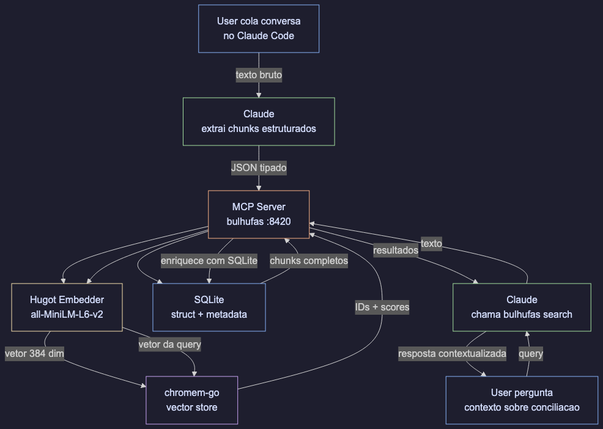

<div align="center">

# bulhufas

**RAG-powered project management that captures what PM tools miss.**

[](https://github.com/HugoluizMTB/bulhufas/actions/workflows/ci.yml)
[](https://pkg.go.dev/github.com/HugoluizMTB/bulhufas)
[](https://goreportcard.com/report/github.com/HugoluizMTB/bulhufas)
[](LICENSE)

[Getting Started](#getting-started) · [How It Works](#how-it-works) · [API](#api) · [Self-Host](#self-hosting) · [Contributing](CONTRIBUTING.md)

</div>

---

### Why "bulhufas"?

*Bulhufas* is Brazilian Portuguese slang for "zilch", "diddly-squat", "bupkis" — absolutely nothing.

As in: "How much does Claude know about that decision your team made on WhatsApp last Thursday?" *Bulhufas.*

"What about that blocker someone mentioned in standup?" *Bulhufas.*

"And that architecture decision from two sprints ago?" You guessed it. *Bulhufas.*

Now it knows.

---

Teams make decisions in Slack, WhatsApp, and meetings — then none of it reaches the PM tool. **bulhufas** captures raw conversations, extracts structured project artifacts (decisions, action items, blockers, scope changes), and makes them searchable via semantic embeddings.

Single binary. No external dependencies. Embeddings run in-process.

## Features

- **Conversation to Structure** — Paste raw chat, get structured chunks: decisions, action items, blockers, requirements, scope changes
- **Semantic Search** — Find context by meaning, not keywords. "What did we decide about auth?" finds the right chunk even if "auth" isn't in the text
- **CRUD on Knowledge** — Update status, add context, archive outdated chunks. Your knowledge base stays current
- **Single Binary** — One Go binary with embedded vector store (chromem-go) and embedding model (hugot/all-MiniLM-L6-v2). No Ollama, no Docker, no external processes
- **Self-Hostable** — Deploy anywhere: Coolify, Railway, Hetzner, AWS, GCP. Runs on a 2GB VPS

## How It Works



```
You paste a conversation into your AI assistant
         |
The LLM extracts structured chunks with metadata
         |
bulhufas stores chunks + generates embeddings in-process (hugot)
         |
Later: "what's pending from last week?" -> semantic search returns relevant chunks
```

### What Gets Captured

| Chunk Type | Example |
|-----------|---------|
| `decision` | "We chose WebSockets over polling for real-time updates" |
| `action_item` | "Hugo will create read-only DB credentials by Friday" |
| `blocker` | "Can't deploy until the SSL cert is renewed" |
| `requirement` | "Client needs CSV export for the finance report" |
| `scope_change` | "Auth module expanded to include SSO" |
| `context` | "The legacy API returns XML, not JSON" |
| `research_finding` | "pgvector outperforms pinecone for our dataset size" |
| `status_update` | "Payment integration is live in staging" |

## Installation

### 1. Build from source

```bash
# Requires Go 1.22+ with CGO enabled
git clone https://github.com/HugoluizMTB/bulhufas.git
cd bulhufas
make build
```

### 2. Add to Claude Code

```bash
claude mcp add --transport stdio --scope user bulhufas -- /absolute/path/to/bulhufas/bin/bulhufas --mcp
```

> Replace `/absolute/path/to` with the actual path where you cloned the repo.
> Use `--scope user` to make it available across all your projects.
> Use `--scope project` to restrict it to the current project only.

### 3. Restart Claude Code and verify

Run `/mcp` inside Claude Code. You should see `bulhufas` connected with 6 tools:

| Tool | Description |
|------|-------------|
| `save_conversation` | Save a conversation with extracted structured chunks |
| `search` | Semantic search across all stored chunks |
| `list_chunks` | List chunks with optional type/status filters |
| `update_status` | Update chunk status by ID |
| `delete_chunk` | Delete a chunk by ID |
| `list_actions` | List all pending action items |

On first run, the embedding model (all-MiniLM-L6-v2, ~80MB) is downloaded automatically to `./data/models/`.

### Run as HTTP Server (optional)

```bash
./bin/bulhufas
```

Starts an HTTP API on port 8420. Use `--mcp` flag for MCP stdio mode instead.

### Environment Variables

| Variable | Default | Description |
|----------|---------|-------------|
| `PORT` | `8420` | Server port |
| `DATA_DIR` | `./data` | Persistent storage directory (SQLite db, model files, vector index) |

## API

### Save a conversation with chunks

```bash
curl -X POST http://localhost:8420/api/conversations \
  -H "Content-Type: application/json" \
  -d '{
    "source": "whatsapp",
    "summary": "Discussion about database access",
    "participants": ["renan", "hugo"],
    "chunks": [
      {
        "content": "Renan needs read-only access to PostgreSQL",
        "type": "decision",
        "tags": ["infra", "postgres"],
        "people": ["renan"],
        "status": "pending",
        "action_item": "Create read-only credentials"
      }
    ]
  }'
```

### Semantic search

```bash
curl -X POST http://localhost:8420/api/search \
  -H "Content-Type: application/json" \
  -d '{"text": "database access", "limit": 5}'
```

### List chunks with filters

```bash
curl "http://localhost:8420/api/chunks?type=blocker&status=pending"
```

### List pending action items

```bash
curl http://localhost:8420/api/actions
```

### Update chunk status

```bash
curl -X PATCH http://localhost:8420/api/chunks/{id}/status \
  -H "Content-Type: application/json" \
  -d '{"status": "resolved"}'
```

### Delete a chunk

```bash
curl -X DELETE http://localhost:8420/api/chunks/{id}
```

### Health check

```bash
curl http://localhost:8420/healthz
```

## Architecture

```
cmd/server/          -> entrypoint, wires everything together
internal/
  domain/            -> core types: Conversation, Chunk, WorkItem, Relation
  mcp/               -> HTTP server, handlers, request/response logic
  store/             -> persistence interface + SQLite implementation
  vectorstore/       -> embedded vector search via chromem-go
  embedder/          -> in-process embeddings via hugot (all-MiniLM-L6-v2)
scripts/             -> test scripts
web/                 -> React dashboard (future)
```

All external dependencies are behind interfaces. Swap SQLite for Postgres, or chromem-go for pgvector — without touching business logic.

### Stack

| Component | Library | Runs in-process? |
|-----------|---------|-----------------|
| Embedding | hugot + all-MiniLM-L6-v2 (384 dim) | Yes |
| Vector store | chromem-go | Yes |
| Database | SQLite (mattn/go-sqlite3) | Yes |
| HTTP server | Go stdlib net/http | Yes |

No Ollama. No Docker. No external databases. One binary.

## Self-Hosting

### Binary

```bash
CGO_ENABLED=1 GOOS=linux go build -o bulhufas ./cmd/server
scp bulhufas your-server:/opt/bulhufas/
ssh your-server '/opt/bulhufas/bulhufas'
```

### Docker

```bash
docker build -t bulhufas .
docker run -d --name bulhufas -p 8420:8420 -v bulhufas-data:/data bulhufas
```

### Docker Compose

```bash
git clone https://github.com/HugoluizMTB/bulhufas.git
cd bulhufas
docker compose up -d
```

Works with Coolify, Railway, Hetzner, AWS, GCP, Oracle Cloud — anything that runs Docker.

## Roadmap

- [x] Core domain types and interfaces
- [x] HTTP API with save/search/update/delete
- [x] SQLite store implementation
- [x] In-process embeddings via hugot (all-MiniLM-L6-v2)
- [x] chromem-go vector store
- [x] Semantic search with SQLite enrichment
- [x] Action items endpoint
- [x] MCP server protocol (stdio transport via mcp-go)
- [x] Docker image
- [ ] React dashboard
- [ ] Slack plugin
- [ ] Remote MCP via SSE transport

## Contributing

See [CONTRIBUTING.md](CONTRIBUTING.md) for setup instructions, code style, and PR process.

## License

[Apache License 2.0](LICENSE) — use it freely, even commercially. Patent protection included.

---

<div align="center">

Created by [@HugoluizMTB](https://github.com/HugoluizMTB)

</div>
